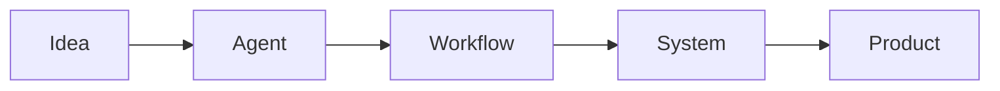

 

  

```mermaid
flowchart LR
    A[Idea] --> B[Agent]
    B --> C[Workflow]
    C --> D[System]
    D --> E[Product]
```

### `AGENTS → WORKFLOWS → RELIABLE SYSTEMS`

 

 

Structure first. Automate carefully. Validate everything.

